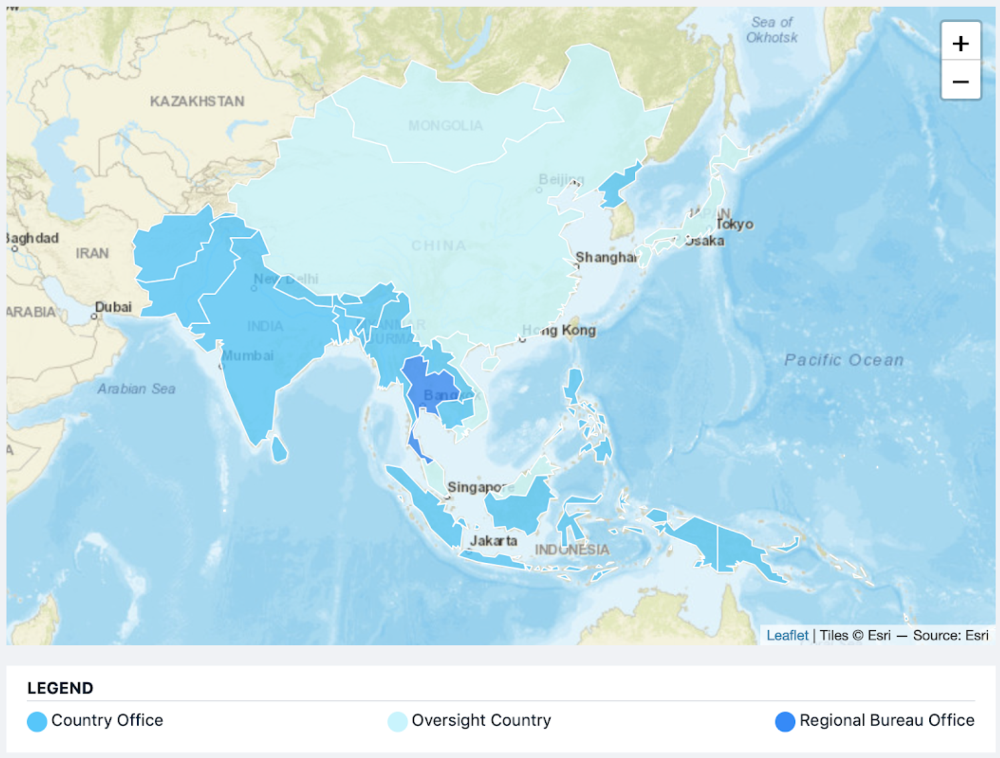

# Introduction

This repository intended to support WFP staff in Regional Bureau Bangkok (RBB) region in disaster preparedness and response activities. Generally it is a compilation of geospatial, earth observation (EO) data and product that might useful for disaster related analysis. Geospatial information provide a better picture for evidence-based decision making during disaster emergency response. 

Decision making to response different type of hazards requires different information. So does datasets necessary for the analysis. The data and information may not be available in one single map. This repository is intended to provide data options and its use for different contexts. 

WFP hosts an extensive set of data related to climate, temperature, vegetation, cropland, population, socio-economic and food security. Some data are originally developed by WFP and partner organizations. Other data are available in public domain and developed by governments, NGOs, and/or companies. The data vary in accuracy, resolution, frequency of update, and geographic coverage. Data summary below mainly highlights the format, methods and technicalities (links to the sources provided). Full download of the datasets is available for most sources.

## How to access?

All the data are stored in WFP Sharepoint and only accessible via WFP intranet network, use your WFP credential to access this repository. 

For further information about this repository or question on data availability and location in Sharepoint, please contact:

!!! question

    **Benny Istanto** 
    [benny.istanto@wfp.org](mailto:benny.istanto@wfp.org) 

    **Ruangdech Poungprom** 
    [ruangdech.poungprom@wfp.org](mailto:ruangdech.poungprom@wfp.org) 

## Contact

VAM Geospatial 
Regional Bureau Bangkok for Asia and the Pacific 
UN World Food Programme 
Bangkok, Thailand 

