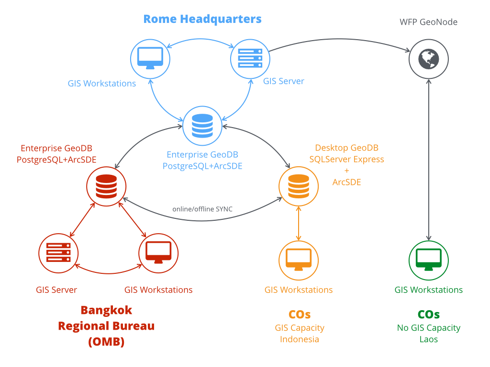

# RBB Spatial Data Infrastructure

WFP has been setting up a Spatial Data Infrastructure (SDI) system – a central repository where ready-to-map information for each country can be stored and shared across WFP, from headquarters, to the regional bureaus, to country offices. The aim is to synchronize data across the organization, with the SDI becoming the single go-to place for the most up-to-date data – thereby reducing any confusion on data validity and redundancy. A regional SDI has already been set up by WFP in Asia Pacific, and the plan is to do the same in other regions.

The SDI repository - [http://gis.wfp.org/arcgis/rest/services](http://gis.wfp.org/arcgis/rest/services) is being populated with socio-economic information (demographics, food security, poverty, etc.), which has been georeferenced (i.e. given geographic coordinates so that it can be mapped) and is ready to be analyzed. Country office and regional bureau staff are responsible for obtaining this data (from open source repositories, governments, existing WFP data, other development or humanitarian organizations, etc.), uploading it to the SDI, and continuously updating/replacing it with the most up-to-date information. 

This data preparedness step is key to being able to produce an initial assessment in the first few hours of a disaster, as it means that precious time is not wasted in collecting, cleaning, and preparing the data, and the analysis can be carried out immediately.



## Expected outputs

The expected output is an operational infrastructure supporting all WFP Preparedness and Response actions by providing:

- a common data model, shared across all levels of the organization
- synchronization services, supporting information exchange in efficient way
- data analysis tools, to quickly and reliably produce value-added information
- standard symbology rules and automated map templates help in enforcing a brand perception
- and in increasing output quality, timeliness and readability
- conditions for setting up a GIS community

## Node

The WFP Regional Bureau for Asia and the Pacific (RBB), located in Bangkok, hosts the pilot implementation of this distributed geodatabase for country office.

### Connections

Contains `*.sde` connection files for country office, bangkok and HQ

!!! info "**Connection Files**"

    **Sharepoint:** [https://wfp.sharepoint.com/:f:/s/RBBGISEO-3/Eg76962g3WFJs0zgykX5T-8BX4i8ZjO9CfFTe7emwMpK6w?e=AFAAUX](https://wfp.sharepoint.com/:f:/s/RBBGISEO-3/Eg76962g3WFJs0zgykX5T-8BX4i8ZjO9CfFTe7emwMpK6w?e=AFAAUX)

### Country Geodatabase

Internet connection is common problem everywhere, especially when dealing with WFP intranet network to accesss the SDI. This folder contains Geodatabase (GDB) files for each country, with naming convention iso3_gis. List country available in below list:

- AFG Afghanistan
- BGD Bangladesh
- FJI Fiji
- FSM Micronesia, Federated States of 
- IDN Indonesiaa
- KHM Cambodia
- KIR Kiribati
- LAO Lao PDR
- LKA Sri Lanka
- MHL Marshall Islands
- MMR Myanmar
- NPL Nepal
- PAK Pakistan
- PHL Philippines
- PLW Palau
- PNG Papua New Guinea
- PRK Democratic People's Republic of Korea
- SLB Solomon Islands
- TLS Timor-Leste
- TON Tonga
- VUT Vanuatu
- WLD World
- WSM Samoa

!!! info "**Country Geodatabase**"

    **Sharepoint:** [https://wfp.sharepoint.com/:f:/s/RBBGISEO-3/EmtmQz0gjIZKuuUQy59FhHQBZy7y5VCEhqAd9lth6FXLcQ?e=B0oT1N](https://wfp.sharepoint.com/:f:/s/RBBGISEO-3/EmtmQz0gjIZKuuUQy59FhHQBZy7y5VCEhqAd9lth6FXLcQ?e=B0oT1N)


### RECCE

In summary for the recce sheet there are three tabs for capturing information (2. CONTACTS, 3. SOURCE, 4. DATASETS) and three tabs for reference (5. Field by Field Guide, 6. Data Naming, 7. Priorities). It is worth familiarising yourself with the reference tabs before getting started, especially the Field by Field Guide tab which covers how to approach the recce sheet if you are migrating data from the old sheet format.

This folder contains Excel spreadsheet of various country data collected under joint activities between WFP RBB and MapAction
!!! info "**RECCE**"

    **Sharepoint:** [https://wfp.sharepoint.com/:f:/s/RBBGISEO-3/EmtmQz0gjIZKuuUQy59FhHQBZy7y5VCEhqAd9lth6FXLcQ?e=B0oT1N](https://wfp.sharepoint.com/:f:/s/RBBGISEO-3/EmtmQz0gjIZKuuUQy59FhHQBZy7y5VCEhqAd9lth6FXLcQ?e=B0oT1N)


### Scripts

Contains example script to create the basic set of users and groups needed. Before running it, please change usernames and passwords in the script according to your environment.

To run the script, save it on the server and follow instructions below.

- Open a Powershell Window
- Browse to the location of the bin folder located in the PostgreSQL installation folder through this command:
	
	`cd “PostgreSQL installation path”\bin` 

Example:

``` PowerShell
cd c:\Program Files\PostgreSQL\9.4\bin
```

- Run the command below and provide the password for the postgres user

	`.\psql –U postgres –d “database name” –a –f “script path”`

Example:

``` PowerShell
.\psql –U postgres –d “bangkok” –a –f “C:\GIS\script_users_creation.psql”
```
!!! note
	Please remember to modify the database name and script path accordingly. Reference: [https://geonode.wfp.org/uploaded/trainings/manuals/GIS_Training_-_Working_with_an_Enterprise_Geodatabase_10_4_1_new.pdf](https://geonode.wfp.org/uploaded/trainings/manuals/GIS_Training_-_Working_with_an_Enterprise_Geodatabase_10_4_1_new.pdf)

Once the basic set of groups and users has been created, you can create additional users, assign them to groups or assign privileges using geo-processing tools.

!!! info "**Script**"

    **Sharepoint:** [https://wfp.sharepoint.com/:f:/s/RBBGISEO-3/EmtmQz0gjIZKuuUQy59FhHQBZy7y5VCEhqAd9lth6FXLcQ?e=B0oT1N](https://wfp.sharepoint.com/:f:/s/RBBGISEO-3/EmtmQz0gjIZKuuUQy59FhHQBZy7y5VCEhqAd9lth6FXLcQ?e=B0oT1N)